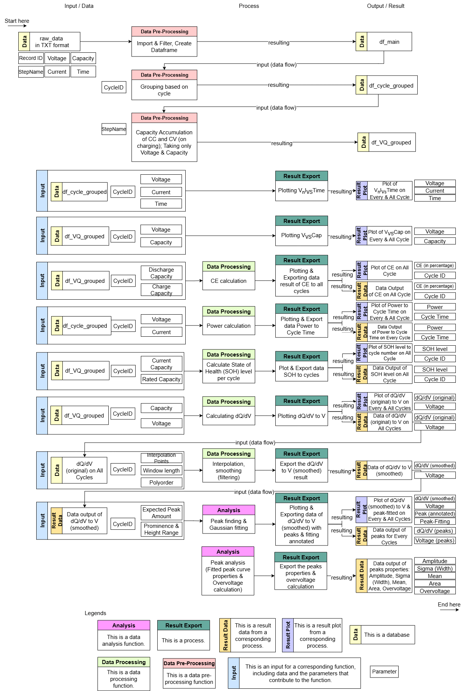

# Battery Experiment Data Analysis - University of Twente (BattExpDataAna-UT)
The **Battery Experiment Data Analysis - University of Twente (BattExpDataAna-UT)** repository is a collection of Python functions designed to process and analyze battery experiment data.t provides tools for importing raw battery test data, processing it into structured DataFrames, and performing various analyses to understand battery performance.he repository includes modules for data import, cycle grouping, and voltage vs. capacity plotting, among other functionalities.t also specifies software dependencies and provides instructions for getting started with the analysis.

## Software Dependencies
- Python
- Python packages (requirements.txt)
  * os
  * pandas
  * functools
  * matplotlib: pyplot, cm
  * numpy
  * re
  * lmfit models: GaussianModel, LorentzianModel, VoigtModel
  * scipy: signal (savgol_filter, find_peaks), interpolate (interp1d), optimize (curve_fit)
  * seaborn (for further development heatmap)
  * scikit-learn (for further development prediction)

## Getting Started
### 1. Clone the Repository:
```bash
git clone https://github.com/hansthieryt/BattExpDataAna-UT.git
cd BattExpDataAna-UT
```

### 2. Install Dependencies
Ensure you have Python installed. Install the required Python packages using:
```bash
pip install -r requirements.txt
```

### 3. Prepare Data
Place your experimental data files in the DA_Data folder. Ensure they are in the correct format as expected by the scripts. Output from Neware BTSDA software with custom setting could result in the csv files which could be exported into series of TXT files in format "{file_name}_{sequence number}".

### 4. Running the Main Script
Execute the main script to start the data processing and analysis workflow:
```bash
python DA_Main.py
```


## Data Requirements
This package is designed to process multiple TXT files labeled in sequence as input and relies on specific column headers. Refer to the 'DA_Data' directory for example dataset files. The column header for each dataset file should include and appear exactly as follows:
- Cycle ID
- Step ID
- Step Name
- Record ID	Time(h:min:s.ms)
- Voltage(V)
- Current(mA)
- Capacity(mAh)
- Energy(mWh)
- Realtime
- dQ/dV(mAh/V)

## Functions Brief


### Data Pre-processing (Import)
#### `DA00_Function_Import`
This function imports raw battery data, compiling it into dataframe, and renaming it accordingly.
#### `DA00_Function_df_Cycle_Grouping`
This function prepares the data on dataframe by grouping and pre-processing by accumulate necessary value, then export to two dataframes.

### Direct Plotting
#### `DA01_Function_VnIvsTime`
This function generates plots of voltage and current variations over time during battery cycling.
#### `DA02_Function_VvsCap`
This function generates voltage vs. capacity plots to evaluate battery performance.

### Data Processing & Plotting
#### `DA01_Function_Power`
This function analyzes power by calculating it through voltage and current data over time during battery cycling.
#### `DA03_Function_Coulombic_Efficiency`
This function calculates Coulombic efficiency, a key indicator of battery charge efficiency, and generates the efficiency vs. cycle plot.
#### `DA04_Function_SOH.py`
This function calculates the State of Health (SOH) of the battery, a key indicator of battery health condition, and generates the SOH percentage vs. cycle plot.

### Data Processing & Analysis
#### `DA06_Function_dQdV`
This function calculates and visualizes the differential capacity (dQ/dV) curves. Following the curves, analysing the peaks detected for electrochemical reaction estimation analysis.


## Organization of the repository
|   DA_Main.py
|   LICENSE
|   README.md
|   requirements.txt
|
+---DA_Data
|   +---B1T1
|   |       B1T1_{sequence number: 0-32}
|   |       ....
|   |
|   +---M1C1
|   |       M1C1_0
|   |       ....
|   |
|   +---M2C1
|   |       M2C1_0
|   |       ....
|   |
|   +---N1T1
|   |       N1T1_{sequence number: 0-61}
|   |       ....
|   |
|
+---DA_Function
|   |   DA00_Function_Import_Main_df.py
|   |   DA00_Function_Import_Main_df_README.md
|   |   DA01_Function_VnIvsTime.py
|   |   DA01_Function_VnIvsTime_README.md
|   |   DA02_Function_VvsCap.py
|   |   DA02_Function_VvsCap_README.md
|   |   DA03_Function_Coulombic_Efficiency.py
|   |   DA03_Function_Coulombic_Efficiency_README.md
|   |   DA04_Function_SOH.py
|   |   DA04_Function_SOH_README.md
|   |   DA05_Function_Statistical_Model.py
|   |   DA06_Function_dQdV.py
|   |   DA06_Function_dQdV_README.md
|   |
|   +---For further development
|   |       ML01_Function_Correlation.py
|   |       ML02_Function_SOH_Prediction.py
|   |
|
+---images
|       DA_Diagram_WhiteBG.png
|   
